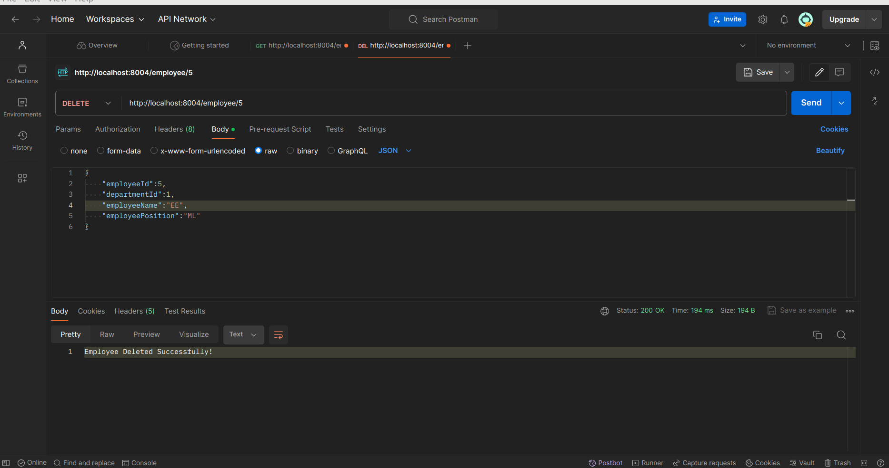

# Employee Microservices REST API

[//]: # (<br/>)


[//]: # (![microservices]&#40;images/microservices.jpg&#41;)

## Documentation

### Database Connection
To connect the Microservices REST API with your department and employee database, database you need change the employee database.<br/>
The employee database, change file [application.yaml](https://github.com/nzangi/employee-microservices/blob/main/employee-service/src/main/resources/application.yaml) <br/>
```angular2html
spring:
  application:
    name: employee-service

  config:
    import: "optional:configserver:http://localhost:8002"

  datasource:
    url: jdbc:mysql://localhost:3306/employee_service
    username: < database username>
    password: < database password>

  jpa:
    show-sql: true
    properties:
      hibernate:
        dialect: org.hibernate.dialect.MySQLDialect
    hibernate:
      ddl-auto: update
```
To change the department database, change file [application.yaml](https://github.com/nzangi/employee-microservices/blob/main/department-service/src/main/resources/application.yaml)
```angular2html

spring:
  application:
    name: department-service

#  cloud:
#    config:
#      enabled: false
  config:
    import: "optional:configserver:http://localhost:8002"

  datasource:
    url: jdbc:mysql://localhost:3306/department_service
    username: < database username>
    password: < database password>

  jpa:
    properties:
      hibernate:
        dialect: org.hibernate.dialect.MySQLDialect
    hibernate:
      ddl-auto: update
    show-sql: true

```
### Project specification
The project employees microservices where we have two services which is department service and employee services.
It also contains a service registry,config server and api-gateway.


### Features
- Create,Delete,Update and Delete an employee
- Create,Delete,Update and Delete a department
- Display the data from employee and department microservices using Spring Reactive Web
- Api gateway which matches the url to the requested microservice.
- Load balancing using api-gateway

### The basic functionalities of the REST API
In the controllers [POST, GET, UPDATE, DELETE] functions are available for the microservices.<br>
## Technologies Used
- Spring Boot: Backend framework for building Java-based web applications.
- MySQL: Relational database management system for data storage.
- API GATEWAY(Spring gateway),CONFIG SERVER AND SERVICE REGISTRY
- IDE/Tool : Ultimate Intellij IDEA
- Postman: For REST API testing

## Installation
1. Clone the repository $ git clone https://github.com/nzangi/employee-microservices.git
2. Import the project inside Intellij IDEA
   -Open Intellij IDEA > choose where project was clone to
3. Make sure you are in the banking-application directory.
4. Ensure you have Java 21 installed.
5. Run the service registry,config server,department service and employee microservice then the apa-gateway. <br>

#### To Run the application you need to install maven and run the given command below:

Open Terminal in Linux or MacOS or CMD on windows and run the
command where you have downloaded the repository.

```
install mvn
```
Then
```
spring-boot:run
```

### Working with Postman on the Microservice
Monitoring the services using eureka server


### Get all the employees


### Get the departmnet services with employees on it.
This data comes from two different databases connected together using spring reactive. Each department payslips all employees from it.


### Get all departments


### Create an employee


### Update employee


### Delete Employeee



### Get all departments


### Create a new department


### Update department


### Delete Department

